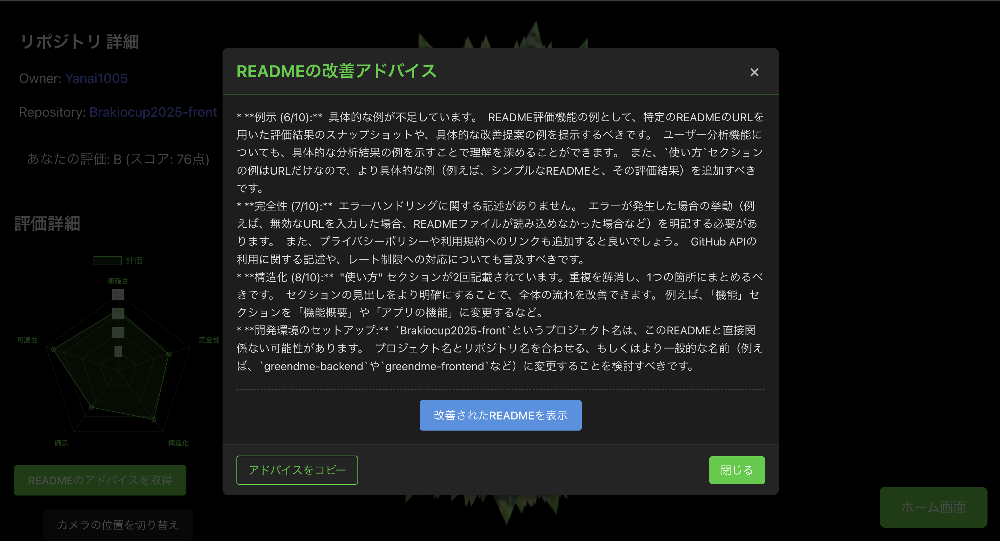

# Greend me - README評価Webアプリ

## 概要
Greend meは、GitHubリポジトリのREADMEファイルを自動で評価し、改善提案を行うWebアプリケーションです。リポジトリのURLを入力するだけで、READMEの質を5つの基準（明確さ、完全性、構造化、例示、可読性）で評価し、具体的な改善点を提案します。

## 主な機能と特長
- GitHubリポジトリURL入力による自動評価: リポジトリのURLを入力するだけで、READMEの質を自動分析します
```
対応形式: https://github.com/username/repo
```
- 5つの評価基準による総合評価: 各項目0〜10点で採点し、総合スコアを100点満点で表示
  - 明確さ: プロジェクトの目的や概要がわかりやすく説明されているか
  - 完全性: 環境構築、インストール手順、使用方法などの必要情報が含まれているか
  - 構造化: 情報が論理的に整理され、見出しや箇条書きが適切に使われているか
  - 例示: 使用例やコード例が含まれ、理解を助けているか
  - 可読性: 文章が読みやすく、専門用語の説明が適切か

改善提案: 具体的な改善点と修正例の提示
<div align="center">
  
</div>

ユーザー分析: GitHubユーザーのリポジトリREADME傾向を分析し、強みと弱みを可視化
<div align="center">
  
</div>

- 3Dビジュアル: Three.jsを使用した直感的なUI（評価に応じて変化する3D表現）

## 使い方
1. READMEの評価

ホーム画面でGitHubリポジトリのURLを入力します

入力例: https://github.com/username/repo

<div align="center">
  
</div>

「README評価」ボタンをクリックします
評価結果が表示されます

<div align="center">
  
</div>

「READMEのアドバイスを取得」ボタンをクリックすると、改善提案と修正例が表示されます
<div align="center">
  
</div>
1. ユーザーのREADME傾向分析
ホーム画面の「ユーザーのREADME傾向分析」ボタンをクリックします
GitHubユーザー名を入力します（例: Yanai1005）
<div align="center">
  
</div>
「プロフィール分析」ボタンをクリックします
ユーザーのリポジトリ全体のREADME傾向が分析されます
<div align="center">
  
</div>

## デモ
アプリケーションの実際の動作は[Youtube](https://youtu.be/nY8PTTqP7kc)からご確認いただけます。


## 技術スタック
- フロントエンド: React, React Router
- 視覚化: Three.js（3Dアニメーション）, Chart.js（データ可視化）
- デプロイ: Google Cloud Run

## 開発環境のセットアップ
### 必要条件
- Node.js v20.13.1以上
- npm 

### セットアップ手順
1. リポジトリのクローン:
   ```bash
   git clone https://github.com/Yanai1005/Brakiocup2025-front.git
   ```
2. プロジェクトディレクトリへの移動:
   ```bash
   cd Brakiocup2025-front
   ```
3. パッケージのインストール:
   ```bash
   npm install
   ```
4. ローカルサーバーを起動
   ```bash
   npm run dev
   ```
ブラウザで http://localhost:5173 を開きます

## メンバー
- [柳井](https://github.com/Yanai1005)
- [三原](https://github.com/NazonoKansatugata)
