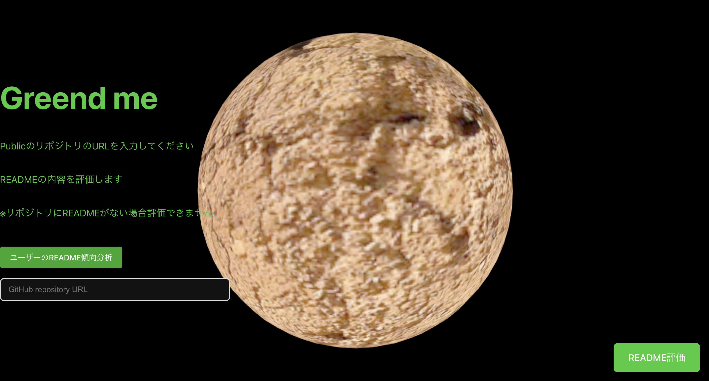

# Greend me - README評価Webアプリ

## 概要
Greend meは、GitHubリポジトリのREADMEファイルを自動で評価し、改善提案を行うWebアプリケーションです。リポジトリのURLを入力するだけで、READMEの質を5つの基準（明確さ、完全性、構造化、例示、可読性）で評価し、具体的な改善点を提案します。

**主な機能:**

* READMEファイルの自動評価（明確さ、完全性、構造化、例示、可読性）: 0〜10点で採点
* 具体的な改善点の提案: 不明瞭な記述箇所の修正案、追加すべき情報などを提示
* 各評価項目ごとの詳細なフィードバック: 問題点と改善策を具体的に説明

## こんな方におすすめです

* README作成に時間をかけたくない方
* READMEの質を高めたい方
* READMEの書き方に自信がない方

## 使い方
1. [アプリケーションURL](ここにアプリケーションのURLを記載) にアクセスしてください。
2. テキストエリアに評価したいREADMEファイルの内容を貼り付けます。
3. 「評価」ボタンをクリックすると、評価結果と改善提案が表示されます。
## 機能
- URL入力による自動評価: GitHubリポジトリのURLを入力するだけでREADMEを評価
- 5つの評価基準: 明確さ、完全性、構造化、例示、可読性の観点から0〜10点で採点
- 視覚的なフィードバック: レーダーチャートによる評価結果の可視化
- 改善提案: 具体的な改善点とサンプルREADMEの提示
- ユーザー分析: GitHubユーザーのリポジトリREADME傾向分析

## デモ
アプリケーションの実際の動作は[Youtube](https://youtu.be/nY8PTTqP7kc)からご確認いただけます。

## 使い方
### READMEの評価
ホーム画面でGitHubリポジトリのURLを入力します（例: https://github.com/username/repo または username/repo）   
「README評価」ボタンをクリックします  
評価結果と詳細なフィードバックが表示されます   
「READMEのアドバイスを取得」ボタンをクリックすると、改善提案と修正例が表示されます
### ユーザーのREADME傾向分析
ホーム画面の「ユーザーのREADME傾向分析」ボタンをクリックします
GitHubユーザー名を入力します
「プロフィール分析」ボタンをクリックします
ユーザーのリポジトリ全体のREADME傾向が分析されます

## 技術スタック
- フロントエンド: React, React Router
- 視覚化: Three.js（3Dアニメーション）, Chart.js（データ可視化）
- デプロイ: Google Cloud Run

## 開発環境のセットアップ
### 必要条件
- Node.js v20.13.1以上
- npm 

### セットアップ手順
1. リポジトリのクローン:
   ```bash
   git clone https://github.com/Yanai1005/Brakiocup2025-front.git
   ```
2. プロジェクトディレクトリへの移動:
   ```bash
   cd Brakiocup2025-front
   ```
3. パッケージのインストール:
   ```bash
   npm install
   ```
4. ローカルサーバーを起動
   ```bash
   npm run dev
   ```
ブラウザで http://localhost:5173 を開きます

## メンバー
- [柳井](https://github.com/Yanai1005)
- [三原](https://github.com/NazonoKansatugata)
